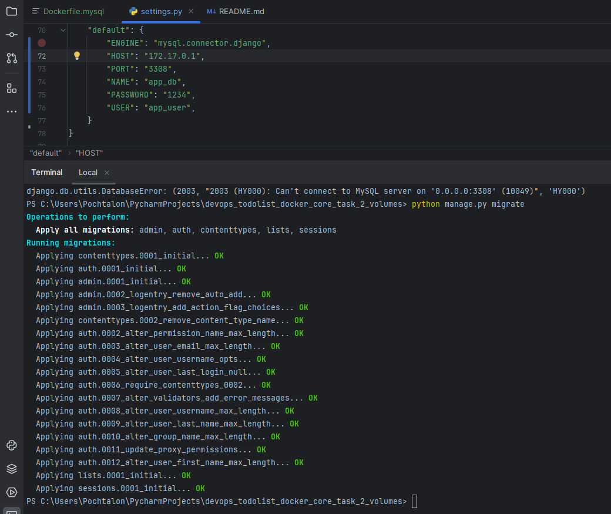
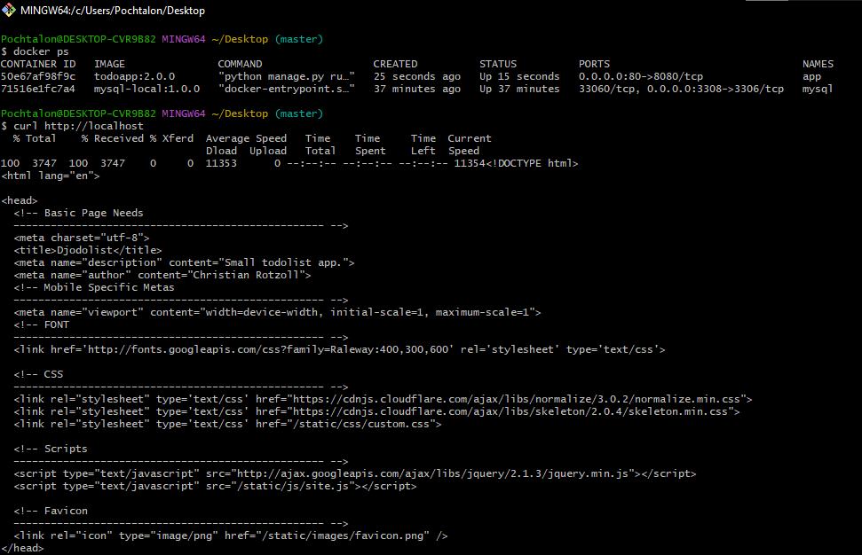

# Django ToDo list: instructions

## Pull the db docker image

```
docker pull pochtalon/mysql-local:1.0.0
```

## Run docker container with db

```
docker run -d -p 3308:3306 --name mysql -v mysql-data:/var/lib/mysql mysql-local:1.0.0
```
### If you run app locally, you'll connect to db in container 


## Pull the app docker image

```
docker pull pochtalon/todoapp:2.0.0
```

## Run docker container with app

```
docker run -d -p 80:8080 --name app todoapp:2.0.0       
```

## Open app in your browser 

http://localhost

# Enjoy)


### P.S. If you run app in container, containers should be connected

