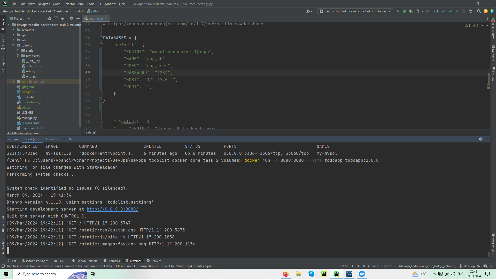

# Django-Todolist

 

####
1. Run MySQL container:
* run MySQL Workbench on your local computer
* pull the image from my Docker Hub - `docker pull script1988/mysql-local:1.0.0`
* docker run  -d -p 3306:3306 --name my-mysql -v my-mysql-data:/var/lib/mysql my-sql:1.0
* change settings for the database to: 
 ```
    DATABASES = {
    "default": {
        "ENGINE": "mysql.connector.django",
        "NAME": "app_db",
        "USER": "app_user",
        "PASSWORD": "1234",
        "HOST": "172.17.0.2",
        "PORT": "",
    }
}

  ```

2. Building image for todoapp:
* pull the image from my Docker Hub - `docker pull script1988/mysql-local:2.0.0`
* docker run -p 8080:8080 --name todoapp todoapp:2.0.0 


### Application should be accessible on `localhost:8080` or `127.0.0.1:8080` in your browser
