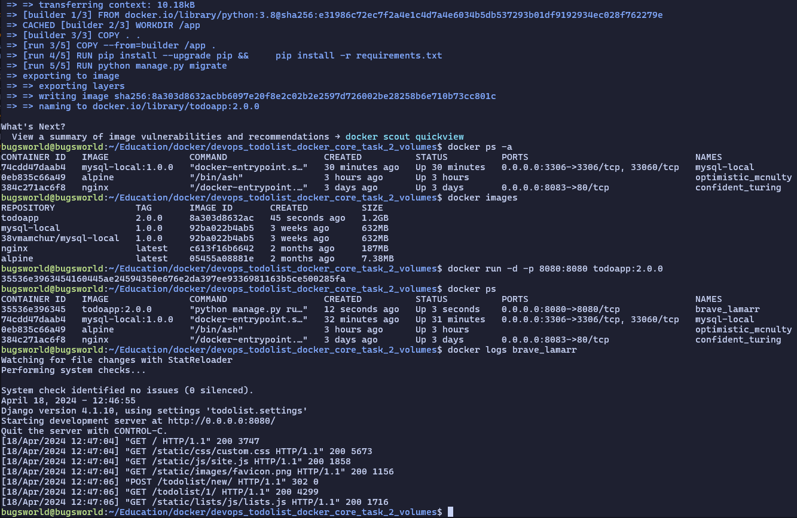

# Django-Todolist

Django-Todolist is a todolist web application with the most basic features of most web apps, i.e. accounts/login, API and (somewhat) interactive UI.

[dockerhub todoapp](https://hub.docker.com/repository/docker/38vmamchur/todoapp/general)
[dockerhub mysql-local](https://hub.docker.com/repository/docker/38vmamchur/mysql-local/general)



## Explore
1. Pull MySQL image: 
```
docker pull 38vmamchur/mysql-local:1.0.0
```

2. Run MySQL container with a volume attached:
```
docker run --name mysql-local -p 3306:3306 -d -v mysql-local/var/lib/mysql 38vmamchur/mysql-local:1.0.0
```

3. Pull application image:
```
docker pull 38vmamchur/todoapp:2.0.0
```

4. Run an application container:
```
docker run --name todoapp -p 8080:8080 -d 38vmamchur/todoapp:2.0.0
```

Now you can browse the [API](http://localhost:8000/api/)
or start on the [landing page](http://localhost:8080/)

